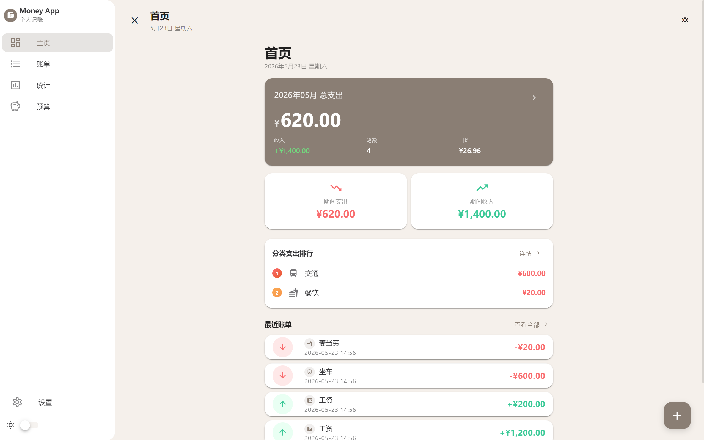
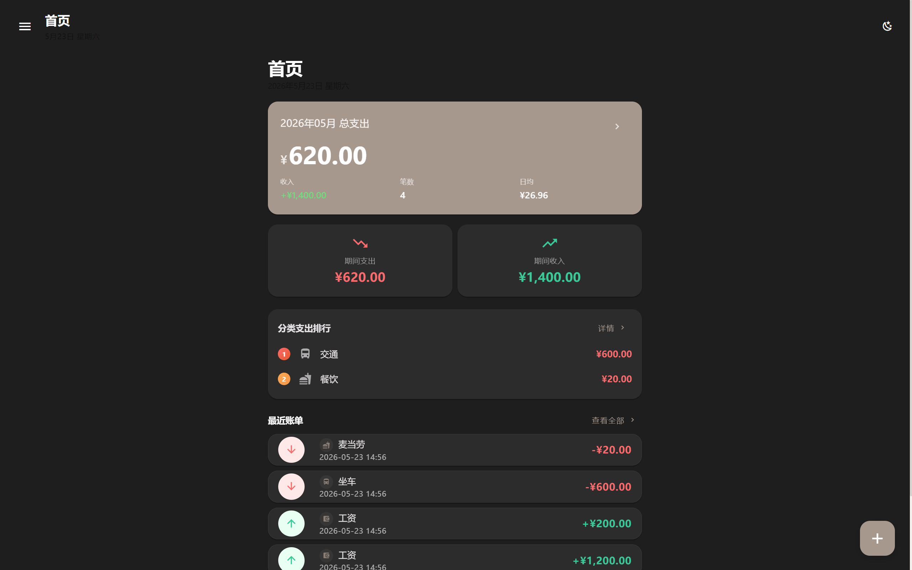
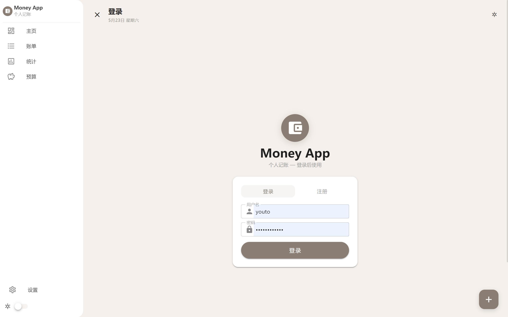
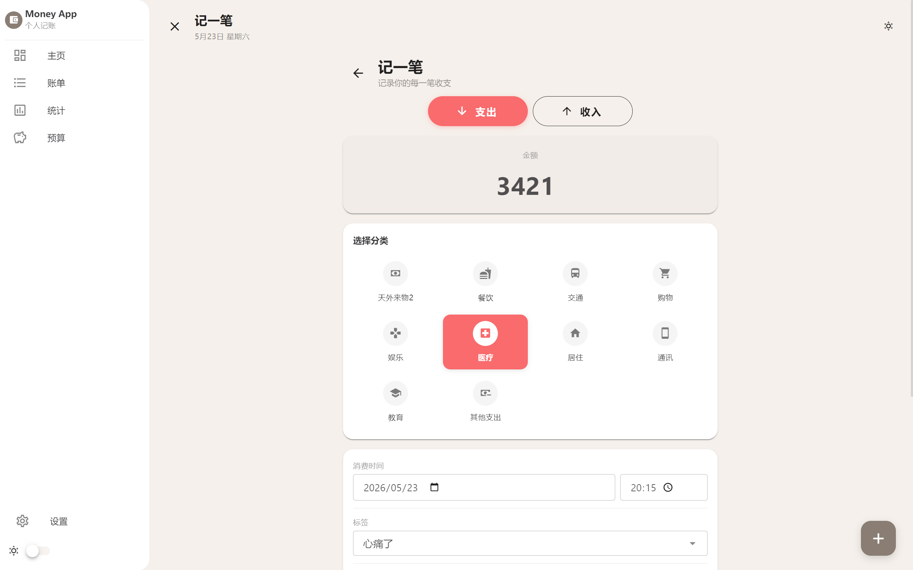
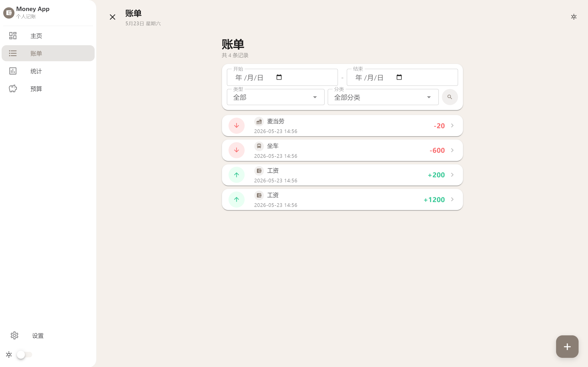
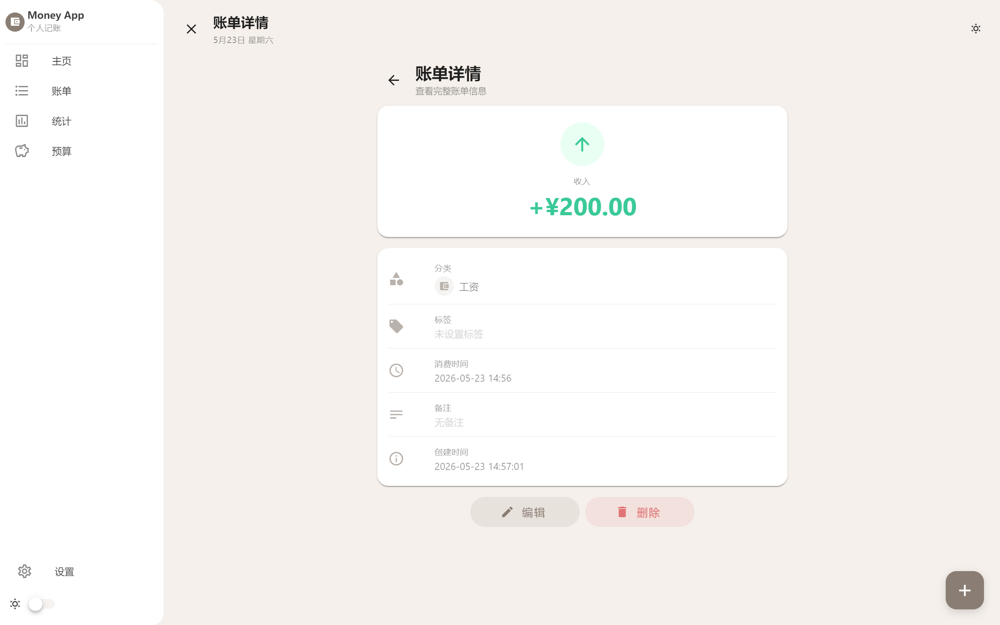
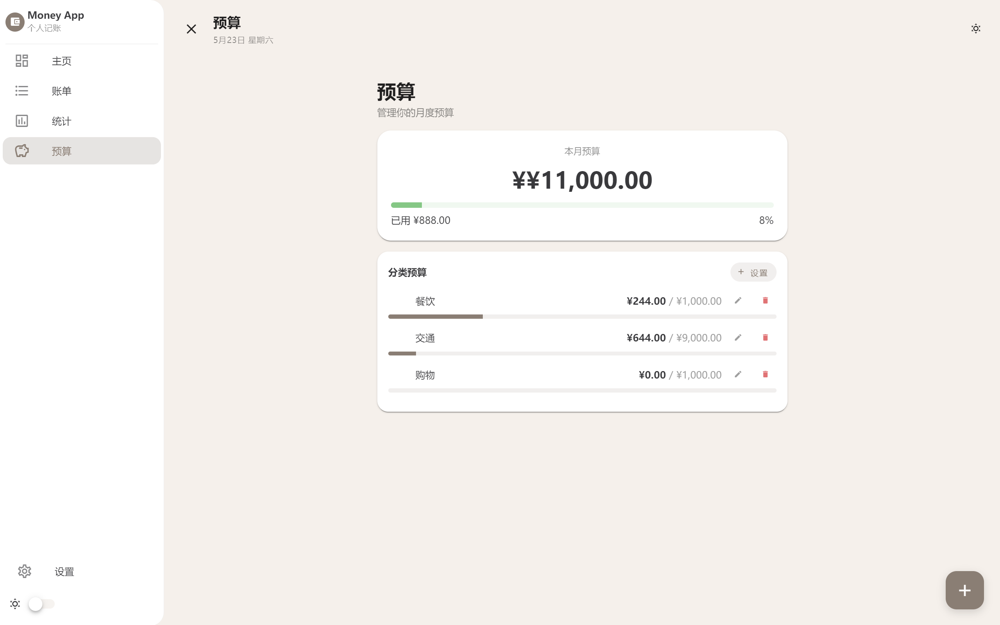
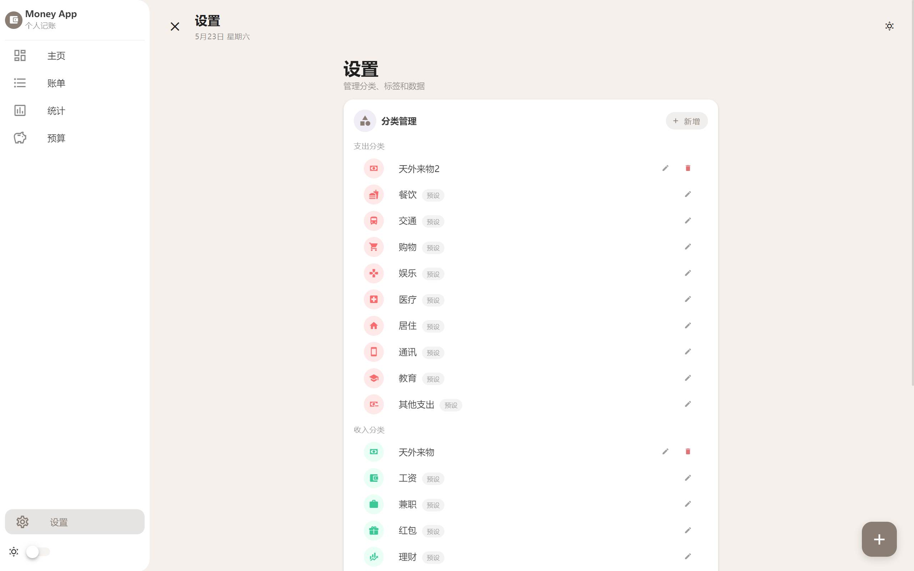

# Money App 💰 — 个人记账程序

一个基于 **Vue 3 + FastAPI** 的全栈个人记账应用，支持收支记录管理、分类标签体系、预算监控、数据统计看板与多用户数据隔离。

## Tech Stack

| 层级 | 技术 |
|------|------|
| **前端** | Vue 3 (Composition API) + Vuetify 3 + Pinia + Vue Router + Chart.js |
| **后端** | Python 3.12 + FastAPI + SQLModel (async) + SQLite |
| **认证** | JWT (python-jose) + bcrypt 密码哈希 |
| **质量** | pytest + mypy strict + Ruff |
| **构建** | Vite + npm |

## Features

- **收支记录** — 记录每一笔收入与支出，支持金额、分类、标签、备注、消费时间
- **分类与标签** — 预设分类 + 用户自定义，自由组合管理记账维度
- **预算管理** — 设置月度总预算和各分类预算，实时监控消费进度
- **统计看板** — 总览统计、分类饼图/柱状图、月度趋势折线图、预算概览
- **月份切换** — 按月筛选账单，横条滑动/按钮切换
- **快速记账** — 基于历史标签的一键填充模板
- **多用户数据隔离** — JWT 认证，每个用户独立管理自己的数据
- **响应式设计** — 竖屏/宽屏自适应，移动端友好

## Screenshots

<p align="center">
  
  
  
</p>
<p align="center">
  
  
  
</p>
<p align="center">
  
  
</p>

## Quick Start

### Prerequisites

- Python 3.12+
- Node.js 18+
- npm

### Backend

```bash
cd backend
python -m venv venv
source venv/bin/activate  # Windows: venv\Scripts\activate
pip install -r requirements.txt
python -m app.main
```

服务启动于 `http://localhost:8000`，API 文档见 `http://localhost:8000/docs`。

### Frontend

```bash
cd frontend
npm install
npm run dev
```

前端启动于 `http://localhost:5173`。

## Project Structure

```
money.app/
├── backend/
│   ├── app/
│   │   ├── main.py              # FastAPI 入口
│   │   ├── config.py            # 配置
│   │   ├── database.py          # 数据库引擎 & session
│   │   ├── models/              # SQLModel 数据模型
│   │   │   ├── record.py        # 账单记录
│   │   │   ├── budget.py        # 预算
│   │   │   ├── category.py      # 分类
│   │   │   ├── tag.py           # 标签
│   │   │   ├── attachment.py    # 附件
│   │   │   └── user.py          # 用户
│   │   ├── schemas/             # Pydantic 请求/响应模型
│   │   ├── routers/             # API 路由
│   │   │   ├── auth.py          # 注册/登录
│   │   │   ├── records.py       # 账单 CRUD
│   │   │   ├── categories.py    # 分类 CRUD
│   │   │   ├── tags.py          # 标签 CRUD
│   │   │   ├── budgets.py       # 预算 CRUD
│   │   │   ├── statistics.py    # 统计数据
│   │   │   └── attachments.py   # 附件上传
│   │   ├── services/            # 业务逻辑层
│   │   └── utils/               # 工具（auth, response）
│   └── tests/                   # pytest 测试
├── frontend/
│   └── src/
│       ├── pages/               # 页面组件
│       ├── components/          # 通用/布局组件
│       ├── stores/              # Pinia 状态管理
│       ├── api/                 # Axios API 调用
│       ├── router/              # Vue Router 配置
│       ├── styles/              # SCSS 全局样式
│       └── utils/               # 工具函数
├── doc/                         # 设计文档
└── start.ps1                    # 一键启动脚本
```

## API Overview

| Method | Endpoint | Description |
|--------|----------|-------------|
| POST | `/api/auth/register` | 用户注册 |
| POST | `/api/auth/login` | 用户登录 |
| GET | `/api/records` | 账单列表（支持筛选/分页） |
| POST | `/api/records` | 创建账单 |
| GET | `/api/records/quick-templates` | 快速记账模板 |
| GET/PUT/DELETE | `/api/records/{id}` | 账单详情/编辑/删除 |
| GET/POST | `/api/categories` | 分类列表/创建 |
| GET/POST | `/api/tags` | 标签列表/创建 |
| GET/POST/PUT | `/api/budgets` | 预算管理 |
| POST | `/api/budgets/batch` | 批量设置预算 |
| GET | `/api/statistics/summary` | 统计总览 |
| GET | `/api/statistics/category-stats` | 分类统计 |
| GET | `/api/statistics/trend` | 月度趋势 |
| GET | `/api/statistics/budget-overview` | 预算概览 |

## Testing & Code Quality

```bash
# 后端测试
cd backend
pytest tests/ -v

# 类型检查
mypy backend/app --strict

# 代码风格
ruff check backend/app
ruff format --check backend/app
```

## Version History

| Version | Highlights |
|---------|------------|
| v1.2 | 数据隔离、预算编辑、统计柱状图、月份切换横条、快速记账标签化 |
| v1.1 | Bug 修复、UI 改进、消费时间、账单详情、预算管理 |
| v1.0 | MVP：基本记账功能、分类管理、统计图表 |

## Roadmap

- v1.3: CSV 导入导出、数据备份恢复、统计图表增强、超支提醒
- v2.0: 移动端应用、云端同步

## License

MIT
