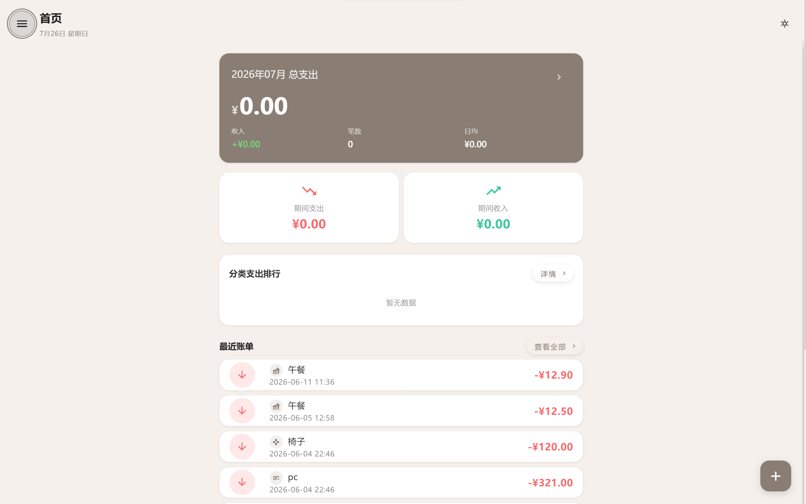
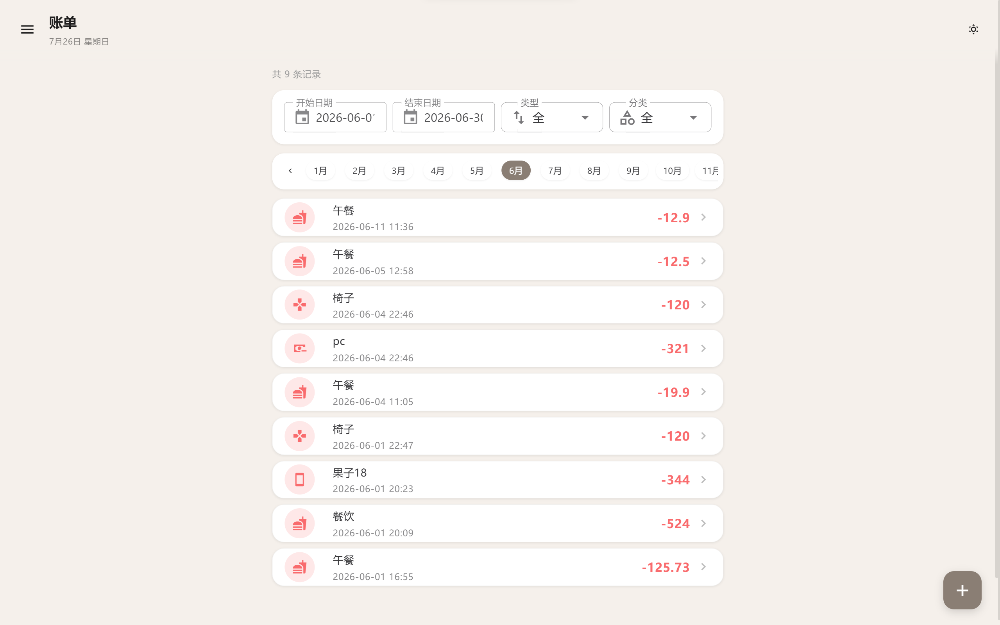
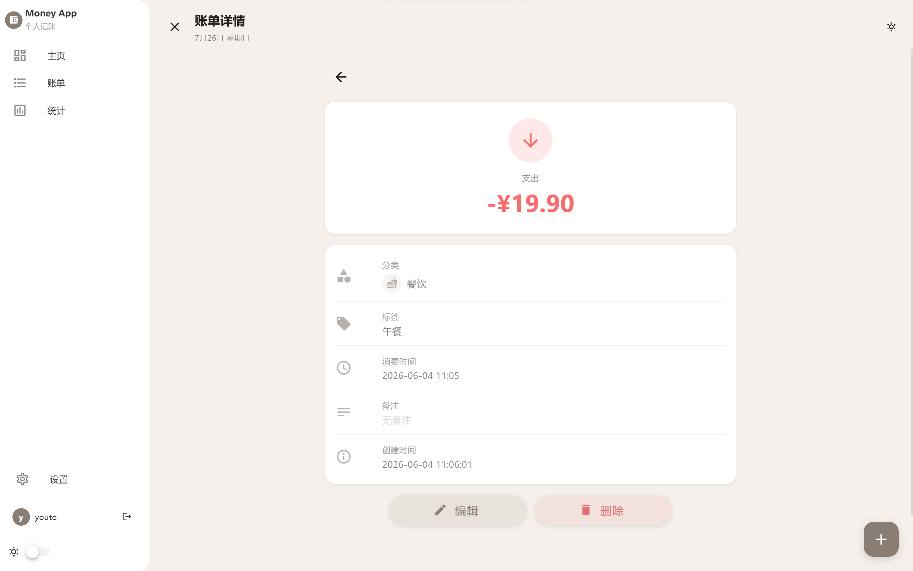
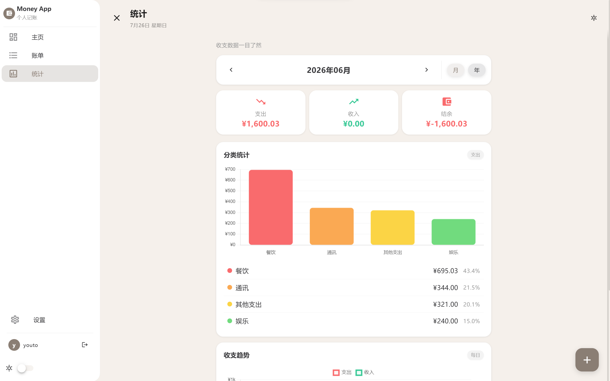
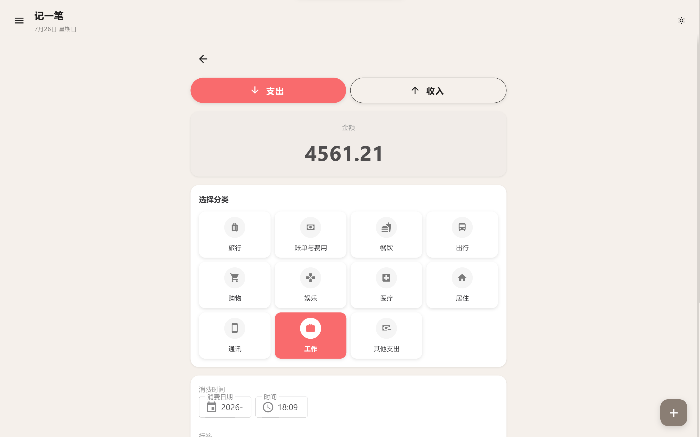
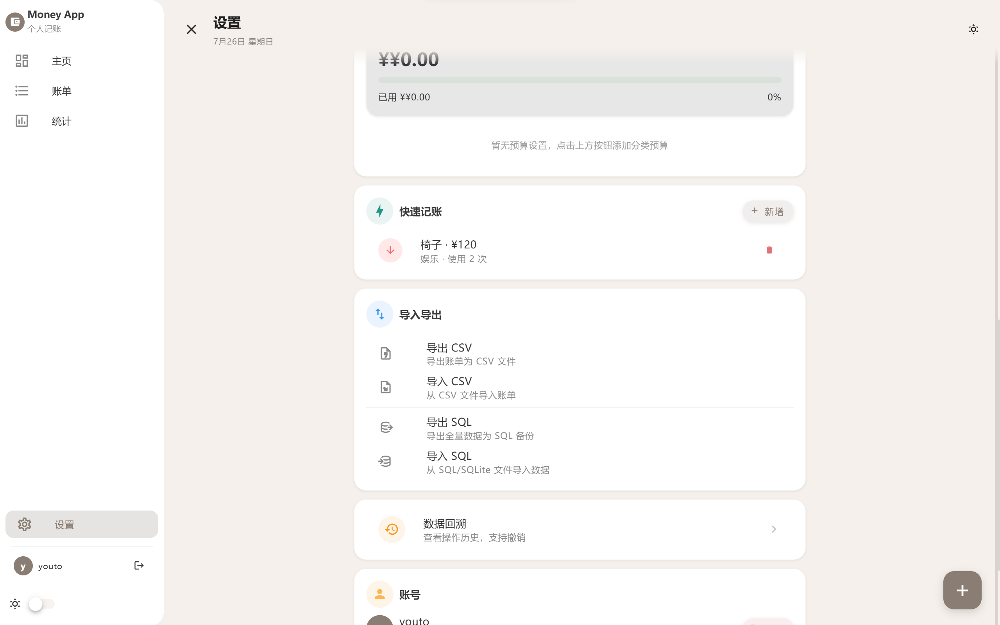
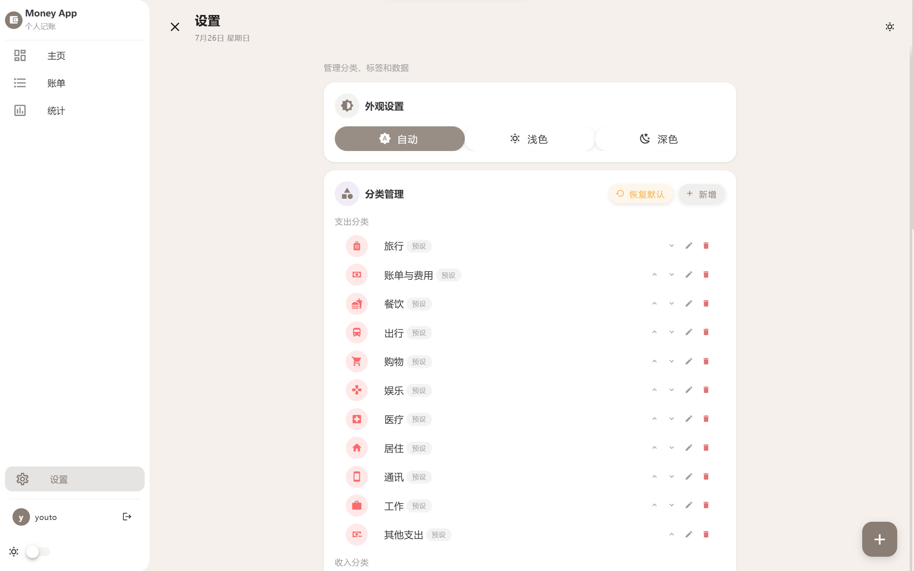

# Money App 💰 — 个人记账程序

一个基于 **Vue 3 + FastAPI** 的全栈个人记账应用，支持收支记录管理、分类标签体系、预算监控、数据统计看板与多用户数据隔离。

## Tech Stack

| 层级           | 技术                                                                |
| -------------- | ------------------------------------------------------------------- |
| **前端** | Vue 3 (Composition API) + Vuetify 3 + Pinia + Vue Router + Chart.js |
| **后端** | Python 3.12 + FastAPI + SQLModel (async) + SQLite                   |
| **认证** | JWT (python-jose) + bcrypt 密码哈希                                 |
| **质量** | pytest + Vitest + mypy strict + Ruff + ESLint + Prettier            |
| **构建** | Vite + npm                                                          |

## Features

### 核心功能

- **收支记录** — 记录每一笔收入与支出，支持金额、分类、标签、备注、消费时间
- **分类与标签** — 预设分类 + 用户自定义，自由组合管理记账维度
- **预算管理** — 设置月度总预算和各分类预算，实时监控消费进度
- **统计看板** — 总览统计、分类柱状图、月度趋势折线图、预算概览
- **快速记账** — 基于历史记录的智能模板，相同账单记录 2 次后自动纳入
- **多用户数据隔离** — JWT 认证，每个用户独立管理自己的数据

## Screenshots

<p align="center">
  
  
  
</p>
<p align="center">
  
  
  
</p>
<p align="center">
  
</p>

## Quick Start

### Prerequisites

- Python 3.12+
- Node.js 18+
- npm

### 一键启动

```bash
# Windows (Git Bash)
bash start.sh

# 或手动启动
cd frontend && npm install && npx vite build && cd ..
cd backend && python -m venv venv && source venv/Scripts/activate && pip install -r requirements.txt && cd ..
cd backend && uvicorn app.main:app --host 0.0.0.0 --port 8000
```

服务启动于 `http://localhost:8000`，手机访问 `http://<本机IP>:8000`，API 文档见 `http://localhost:8000/docs`。

### 开发模式

```bash
# 后端
cd backend
python -m venv venv
source venv/bin/activate  # Windows: venv\Scripts\activate
pip install -r requirements.txt
uvicorn app.main:app --reload

# 前端
cd frontend
npm install
npm run dev
```

### Docker 部署

```bash
# 构建镜像
docker build -t money-app .

# 运行容器（挂载数据目录持久化）
docker run -d --name money-app -p 8000:8000 \
  -v $(pwd)/data:/data \
  --env-file .env \
  money-app
```

### 环境变量（生产部署必填）

复制 `.env.example` 为 `.env` 并修改：

| 变量             | 说明                                                                                |
| ---------------- | ----------------------------------------------------------------------------------- |
| `APP_ENV`      | 设为 `production` 启用安全守卫（强制自定义 SECRET_KEY、CORS 白名单）              |
| `SECRET_KEY`   | 生产必须改为随机串：`python -c "import secrets;print(secrets.token_urlsafe(64))"` |
| `CORS_ORIGINS` | 允许的前端来源，逗号分隔，如 `https://money.example.com`                          |
| `DATABASE_URL` | SQLite 路径，容器内用 `/data/db/money.db`                                         |
| `UPLOAD_DIR`   | 附件存储目录，容器内用 `/data/uploads`                                            |

存量库升级：

```bash
cd backend
python migrate_to_v1.4.py       # v1.4 引入附件 user_id 等字段
python migrate_to_v1.4.2.py     # v1.4.2 引入 quick_templates.kind 列（幂等，可重跑）
```

## Project Structure

```
money.app/
├── backend/
│   ├── app/
│   │   ├── main.py              # FastAPI 入口
│   │   ├── config.py            # 配置
│   │   ├── database.py          # 数据库引擎 & session
│   │   ├── models/              # SQLModel 数据模型
│   │   │   ├── record.py        # 账单记录
│   │   │   ├── budget.py        # 预算
│   │   │   ├── category.py      # 分类
│   │   │   ├── tag.py           # 标签（支持软删除）
│   │   │   ├── quick_template.py # 快速记账模板
│   │   │   ├── attachment.py    # 附件
│   │   │   ├── operation_history.py # 操作历史
│   │   │   └── user.py          # 用户
│   │   ├── schemas/             # Pydantic 请求/响应模型
│   │   ├── routers/             # API 路由
│   │   │   ├── auth.py          # 注册/登录
│   │   │   ├── records.py       # 账单 CRUD + 快速模板
│   │   │   ├── categories.py    # 分类 CRUD
│   │   │   ├── tags.py          # 标签 CRUD（支持搜索）
│   │   │   ├── budgets.py       # 预算 CRUD
│   │   │   ├── statistics.py    # 统计数据
│   │   │   ├── attachments.py   # 附件上传
│   │   │   ├── export.py        # CSV/SQL 导出
│   │   │   ├── import_.py       # CSV/SQL 导入
│   │   │   └── history.py       # 操作历史与回溯
│   │   ├── services/            # 业务逻辑层
│   │   └── utils/               # 工具（auth 鉴权, ratelimit 限流, money 金额取整,
│   │                                response 响应封装, history 操作历史, cache, file_utils）
│   ├── migrate_to_v1.4.py       # 存量数据库迁移脚本（v1.4）
│   ├── migrate_to_v1.4.2.py     # 存量数据库迁移脚本（v1.4.2，幂等）
│   └── tests/                   # pytest 测试（197 个用例，含 IDOR/限流安全回归）
├── frontend/
│   └── src/
│       ├── pages/               # 页面组件
│       ├── components/          # 通用/布局组件
│       │   ├── common/
│       │   │   ├── ExpandTransition.vue    # 展开动画过渡组件
│       │   │   ├── DatePickerPopover.vue   # 日历弹出选择器
│       │   │   ├── ConfirmDialog.vue       # 确认对话框
│       │   │   └── CsvMappingDialog.vue    # CSV 导入映射弹窗
│       │   └── layout/
│       │       └── AppLayout.vue # 主布局（响应式侧边栏/底部导航）
│       ├── stores/              # Pinia 状态管理
│       ├── api/                 # Axios API 调用
│       ├── router/              # Vue Router 配置
│       ├── styles/              # SCSS 全局样式
│       └── utils/               # 工具函数
├── doc/                         # 设计文档
├── .github/workflows/ci.yml     # CI：ruff + pytest 自动化
└── start.sh                     # 一键启动脚本
```

## API Overview

| Method         | Endpoint                              | Description                   |
| -------------- | ------------------------------------- | ----------------------------- |
| GET            | `/health`                           | 健康检查（探活，免鉴权）      |
| POST           | `/api/auth/register`                | 用户注册                      |
| POST           | `/api/auth/login`                   | 用户登录                      |
| GET            | `/api/records`                      | 账单列表（支持筛选/分页）     |
| POST           | `/api/records`                      | 创建账单                      |
| POST           | `/api/records/batch-delete`         | 批量删除账单                  |
| GET            | `/api/records/earliest-year`        | 最早记录年份（年份切换边界）  |
| GET            | `/api/records/quick-templates`      | 快速记账模板（自动+手动）     |
| POST           | `/api/records/quick-templates`      | 手动添加快速模板              |
| DELETE         | `/api/records/quick-templates/{id}` | 删除快速模板                  |
| DELETE         | `/api/records/quick-templates/auto` | 按签名忽略自动模板            |
| GET/PUT/DELETE | `/api/records/{id}`                 | 账单详情/编辑/删除            |
| GET/POST       | `/api/categories`                   | 分类列表/创建                 |
| PUT            | `/api/categories/reorder`           | 分类批量重排（拖拽排序）      |
| PUT/DELETE     | `/api/categories/{id}`              | 分类编辑/删除（级联）         |
| GET            | `/api/tags`                         | 标签列表（全量，支持 `?q=` 搜索） |
| GET            | `/api/tags/paged`                   | 标签分页（展开更多）          |
| POST           | `/api/tags`                         | 标签创建（需关联分类）        |
| PUT/DELETE     | `/api/tags/{id}`                    | 标签编辑/软删除               |
| GET/POST/PUT   | `/api/budgets`                      | 预算管理                      |
| POST           | `/api/budgets/batch`                | 批量设置预算                  |
| GET            | `/api/budgets/year-summary`         | 年度逐月预算概览（统计页）    |
| GET            | `/api/statistics/summary`           | 统计总览                      |
| GET            | `/api/statistics/category-stats`    | 分类统计                      |
| GET            | `/api/statistics/trend`             | 月度趋势                      |
| GET            | `/api/statistics/budget-overview`   | 预算概览                      |
| GET            | `/api/export/csv`                   | 导出 CSV                      |
| GET            | `/api/export/sql`                   | 导出 SQL                      |
| POST           | `/api/import/csv/preview`           | CSV 导入预览                  |
| POST           | `/api/import/csv`                   | CSV 导入确认                  |
| POST           | `/api/import/sql/preview`           | SQL 导入预览                  |
| POST           | `/api/import/sql`                   | SQL 导入确认                  |
| GET            | `/api/history`                      | 操作历史列表                  |
| GET            | `/api/history/{id}`                 | 历史详情                      |
| POST           | `/api/history/{id}/rollback`        | 执行回溯                      |

## Testing & Code Quality

```bash
# 后端测试（197 个用例，含 IDOR/限流安全回归）
cd backend
pytest tests/ -v

# 类型检查
mypy backend/app --strict

# 代码风格
ruff check backend/app
ruff format --check backend/app

# 前端测试（191 个用例）
cd frontend
npm run test

# 前端代码检查
npm run lint        # ESLint
npm run format      # Prettier

# 前端构建
npm run build
```

## Version History

| Version | Highlights                                                                                                |
| ------- | --------------------------------------------------------------------------------------------------------- |
| v1.4.2  | 分类图标精选面板、分类拖拽排序 +「其他」置尾、设置二级页统一卡片容器、标签解除 20 条上限并分页展开、快速记账删除模板修复（按签名忽略）、柱状图过渡动画、设置/统计页入口图标统一 |
| v1.4.1  | 体验优化：登录页沉浸模式、竖屏年份切换、返回状态记忆、宽屏滚动修复、预算迁移统计页（年视图逐月下钻）、设置页二级页瘦身、请求合并防闪烁、筛选精简为起止日期、表盘时钟 |
| v1.4    | CSV/SQL 导入导出（Cashew 兼容、分类/标签映射、SQLite 二进制自动识别）、数据回溯与历史自动清理、安全加固（鉴权统一/IDOR 修复/附件归属/登录限流/CORS 白名单/密钥守卫/金额精度/健康检查）、Docker、CI |
| v1.3    | UI/UX 优化：未保存提醒、日历选择器动画、详情展开动画、分类图标、模糊渐变、宽屏适配                              |
| v1.2.2  | 移动端底部导航栏、设置页一体化管理、标签搜索联想、标签软删除、账单筛选自动触发、深色模式优化              |
| v1.2.1  | 数据隔离安全加固、分类级联删除、统计柱状图、预算编辑、月份切换横条、深色模式修复                          |
| v1.2    | 数据隔离、预算编辑、统计柱状图、月份切换横条、快速记账标签化                                              |
| v1.1    | Bug 修复、UI 改进、消费时间、账单详情、预算管理                                                           |
| v1.0    | MVP：基本记账功能、分类管理、统计图表                                                                     |

## Roadmap

- v2.0: 移动端应用、云端同步

## License

MIT
